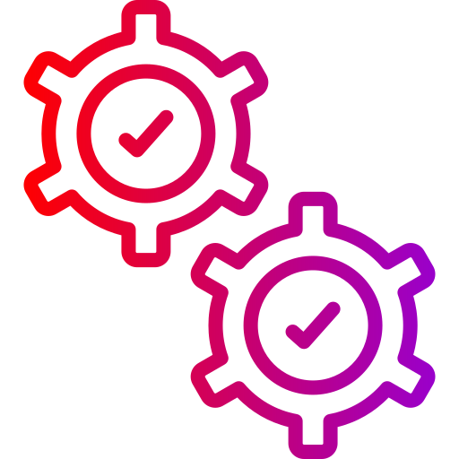

#  Automated Testing with Postman

## Welcome!

This project focuses on testing different functionalities of the <a href="https://www.automationexercise.com/">Automation Exercise Website</a> through automated API tests using Postman. Additionally, the project includes continuous integration (CI) with GitHub Actions.

14 scenarios were tested from the Automation Exercise <a href="https://www.automationexercise.com/api_list">website</a> and implementent in this project.

- API 1: Get All Products List
- API 2: POST To All Products List
- API 3: Get All Brands List
- API 4: PUT To All Brands List
- API 5: POST To Search Product
- API 6: POST To Search Product without search_product parameter
- API 7: POST To Verify Login with valid details
- API 8: POST To Verify Login without email parameter
- API 9: DELETE To Verify Login
- API 10: POST To Verify Login with invalid details
- API 11: POST To Create/Register User Account
- API 12: DELETE METHOD To Delete User Account
- API 13: PUT METHOD To Update User Account
- API 14: GET user account detail by email

##  Prerequisites

Before you begin, ensure you have the following installed on your machine:

- Node.js.
- npm (Node Package Manager): *Comes with Node.js installation.*
- Postman.

##  Set up 

1. Clone this repository to your local machine.
2. Navigate to the project directory.
3. Install dependencies: `npm install`.

##  Run tests

Test scenarios are available in `automation-exercise.postman_collection.json`, and you can run them using Postman or Newman

### Running Tests with Postman

- From this repository download `automation-exercise.postman_collection.json` file to your local machine.
- In Postman, click on the "Import" button located at the top left and drop `automation-exercise.postman_collection.json` file.
- Postman will automatically add the collection, and you will see all predefined API requests.

### Running Tests with Newman

- Open terminal window and and execute the test script: `npm run test`.

##  CI Integration with GitHub Actions

This project includes a GitHub Actions workflow that automatically runs the Cypress tests each time the main branch is updated.

### GitHub Actions Workflow
The CI process is defined in the `.github/workflows/main.yml` file.

### How to View Test Results
Test results can be viewed in the "Actions" tab of your GitHub repository. Each workflow run will show the logs of the test execution, including any failures or errors encountered during the test runs.

